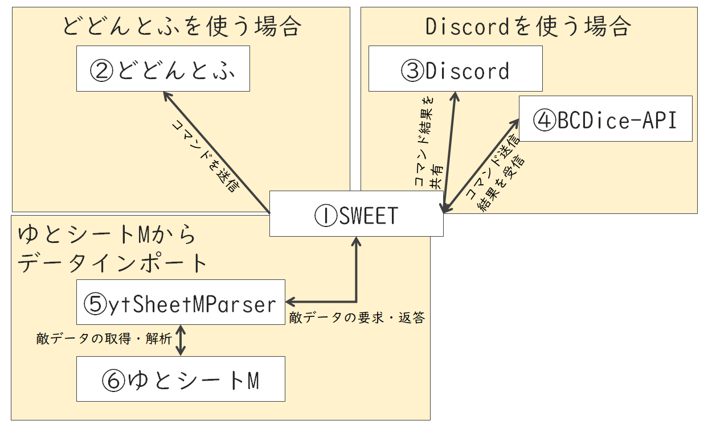
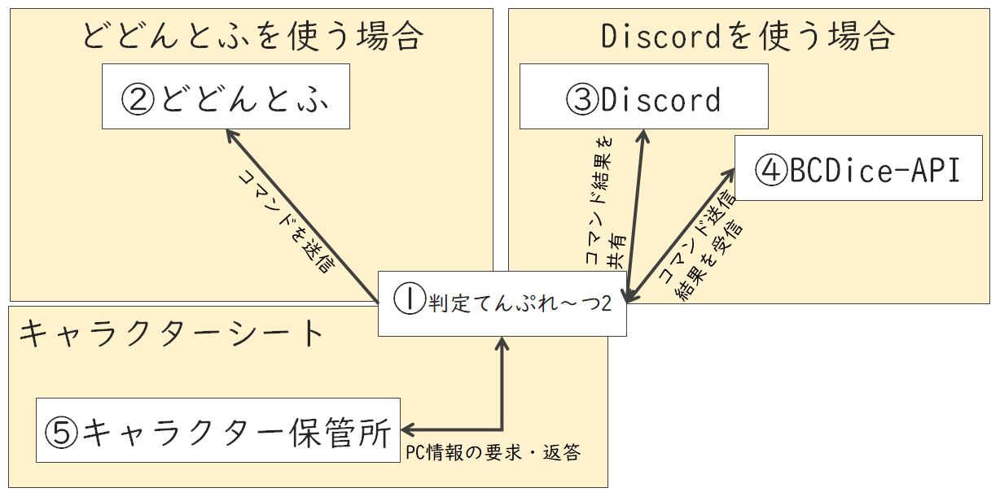

# 各アプリとの関係

## GM 向きツール SWEET

### SWEET 各部の役割

1. SWEET …… 各関係アプリを連携させ、セッションの円滑化を実現します
2. どどんとふ …… セッション会場となります。SWEET はどどんとふに対して情報を送信し、PL 達に共有します ([どどんとふ＠えくすとり～む](http://www.dodontof.com/))
3. Discord …… セッション会場となります。SWEET は Discord に対して情報を送信し、PL 達に共有します　([Discord](https://discordapp.com/))
4. BCDice-API …… ダイスサーバです。Discord を使う場合、ダイスは Discord 上ではなくこちらで振られます ([bcdice-api](https://github.com/ysakasin/bcdice-api))
5. ytSheetMParser …… ゆとシートMの情報を SWEET に取り込むための中継サーバです。Algorithmia 上に配置されています ([ytSheetMParser](https://algorithmia.com/algorithms/Shunshun94/ytSheetMParser))
6. ゆとシートM …… SW2.0 の魔物データを保管・共有するためのアプリです ([ゆとシートM for SW2.](http://yutorize.2-d.jp/page/YtSheetM-for-SW2.0))

### SWEET が要求する情報

#### ゆとシート M を使う場合

使わなくてもアプリは利用可能ですが、魔物データをゆとシートMから取り込めるので便利です。

* Algorithmia のトークン …… Algorithmia のアカウントを作ればもらえるトークンです

#### どどんとふを使う場合

* どどんとふの URL …… オンセを実施するどどんとふの URL です。有名なサーバはサジェストされます
* どどんとふの部屋番号 …… オンセを実施するどどんとふの部屋です。どどんとふの URL を入力すれば一覧が表示されるので選択が可能です
* どどんとふの部屋パスワード …… オンセを実施するどどんとふの部屋のパスワードです

#### Discord を使う場合

事前に SWEET が使う Discord bot の用意が必要です

* Discord の bot トークン …… Discord 上で動作する bot のトークンです
* Discord のチャネル …… オンセで利用する Discord のチャネルです。 bot トークンを入れれば一覧が表示されるので選択が可能です

## PL 向きツール そどわに判定てんぷれ～つ2

### そどわに判定てんぷれ～つ2 各部の役割

1. SWEET …… 各関係アプリを連携させ、セッションの円滑化を実現します
2. どどんとふ …… セッション会場となります。SWEET はどどんとふに対して情報を送信し、他のプレイヤーに共有します ([どどんとふ＠えくすとり～む](http://www.dodontof.com/))
3. Discord …… セッション会場となります。SWEET は Discord に対して情報を送信し、他のプレイヤーに共有します　([Discord](https://discordapp.com/))
4. BCDice-API …… ダイスサーバです。Discord を使う場合、ダイスは Discord 上ではなくこちらで振られます ([bcdice-api](https://github.com/ysakasin/bcdice-api))
5. ytSheetMParser …… ゆとシートMの情報を SWEET に取り込むための中継サーバです。Algorithmia 上に配置されています ([ytSheetMParser](https://algorithmia.com/algorithms/Shunshun94/ytSheetMParser))
6. ゆとシートM …… SW2.0 の魔物データを保管・共有するためのアプリです ([ゆとシートM for SW2.](http://yutorize.2-d.jp/page/YtSheetM-for-SW2.0))

### そどわに判定てんぷれ～つ2 が要求する情報

#### キャラクター保管所

キャラクターシートの ID が必要です

[https://charasheet.vampire-blood.net/e19be9d440e2996113998dc9399d193e (https://charasheet.vampire-blood.net/1955553)](https://charasheet.vampire-blood.net/1955553) を使う場合、 *1955553* を入力します

#### どどんとふを使う場合

* どどんとふの URL …… オンセを実施するどどんとふの URL です。有名なサーバはサジェストされます
* どどんとふの部屋番号 …… オンセを実施するどどんとふの部屋です。どどんとふの URL を入力すれば一覧が表示されるので選択が可能です
* どどんとふの部屋パスワード …… オンセを実施するどどんとふの部屋のパスワードです

#### Discord を使う場合

事前に SWEET が使う Discord bot の用意が必要です

* Discord の bot トークン …… Discord 上で動作する bot のトークンです
* Discord のチャネル …… オンセで利用する Discord のチャネルです。 bot トークンを入れれば一覧が表示されるので選択が可能です

